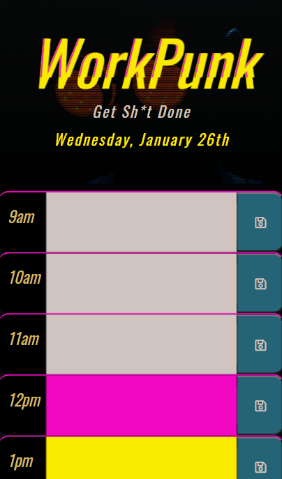

# WorkPunk ☢️

Get ready to kick procrastination in the teeth, only instead of using your Doc Marten boots, you'll be doing it with WorkPunk. 💀

## 📚 Table of Contents
- [WorkPunk ☢️](#workpunk-️)
  - [📚 Table of Contents](#-table-of-contents)
  - [🧾 Features](#-features)
  - [📖 Description](#-description)
  - [🛠️ Installation](#️-installation)
  - [👨‍🏫 Usage](#-usage)
  - [🥂 Credits](#-credits)
  - [📇 License](#-license)
  - [👋 How to Contribute](#-how-to-contribute)

## 🧾 Features
- A daily planner for creating a schedule
- Displays the current day at the top of the planner
- Time blocks for standard business hours
- Time blocks are color-coded to indicate whether it is in the past, present or future
- Clickable time blocks for entering events
- User can click the save button to store event to local storage
- Saved events persist

## 📖 Description

📓 This repo contains a simple calendar application created for the purpose of helping busy executives organize important events into a daily planner. WorkPunk aims to help people manage their time effectively whether they be employees, bosses, students, or radical anarchist cyberpunks. 

⚙️ The app runs in the browser and features dynamically updated HTML and CSS powered by jQuery along with styling in Sass using the Bootstrap library and Font Awesome for the icons.

## 🛠️ Installation
Locate the dropdown menu labeled 'Code' to the left of the About section in the main page of this repository. From there, select your preferred cloning method from HTTPS, SSH, or the GitHub CLI. For this demonstration, we will be using the SSH method. Copy the link and head to your terminal. From the command line you should enter:

    git clone <INSERT_SSH_KEY_HERE>

Replacing the above placeholder with the link copied from GitHub. This will clone the repository into a local directory on your machine. And that's it! Happy Hacking! 🚀

## 👨‍🏫 Usage
This code is strictly for use as part of the anarcho-crypto-rebel alliance rogue squadron punk crew and is only provided as material for study and otherwise double-checking implementation of various third-party APIs. Any violations of these use cases will result in a horde of poseurs descending on the violating fife hence and forthwith. Screenshots of original mockup are included.

   

Mobile-responsive version

**Supports most major touchscreen devices**

  

## 🥂 Credits
UT Austin Coding Boot Camp https://techbootcamps.utexas.edu/coding/

Kyle Ferguson https://github.com/kferguson52

Stack Overflow https://stackoverflow.com/

W3 Schools https://www.w3schools.com/

MDN Web Docs https://developer.mozilla.org/en-US/

Isaac 'Kayla' Doud https://codepen.io/cipherbeta/pen/YLdVjw

## 📇 License
MIT License

Copyright (c) 2021 Keenan R. Chiasson

Permission is hereby granted, free of charge, to any person obtaining a copy
of this software and associated documentation files (the "Software"), to deal
in the Software without restriction, including without limitation the rights
to use, copy, modify, merge, publish, distribute, sublicense, and/or sell
copies of the Software, and to permit persons to whom the Software is
furnished to do so, subject to the following conditions:

The above copyright notice and this permission notice shall be included in all
copies or substantial portions of the Software.

THE SOFTWARE IS PROVIDED "AS IS", WITHOUT WARRANTY OF ANY KIND, EXPRESS OR
IMPLIED, INCLUDING BUT NOT LIMITED TO THE WARRANTIES OF MERCHANTABILITY,
FITNESS FOR A PARTICULAR PURPOSE AND NONINFRINGEMENT. IN NO EVENT SHALL THE
AUTHORS OR COPYRIGHT HOLDERS BE LIABLE FOR ANY CLAIM, DAMAGES OR OTHER
LIABILITY, WHETHER IN AN ACTION OF CONTRACT, TORT OR OTHERWISE, ARISING FROM,
OUT OF OR IN CONNECTION WITH THE SOFTWARE OR THE USE OR OTHER DEALINGS IN THE
SOFTWARE.

## 👋 How to Contribute

See the [Contributor Covenant](https://www.contributor-covenant.org/) for details on how to contribute
